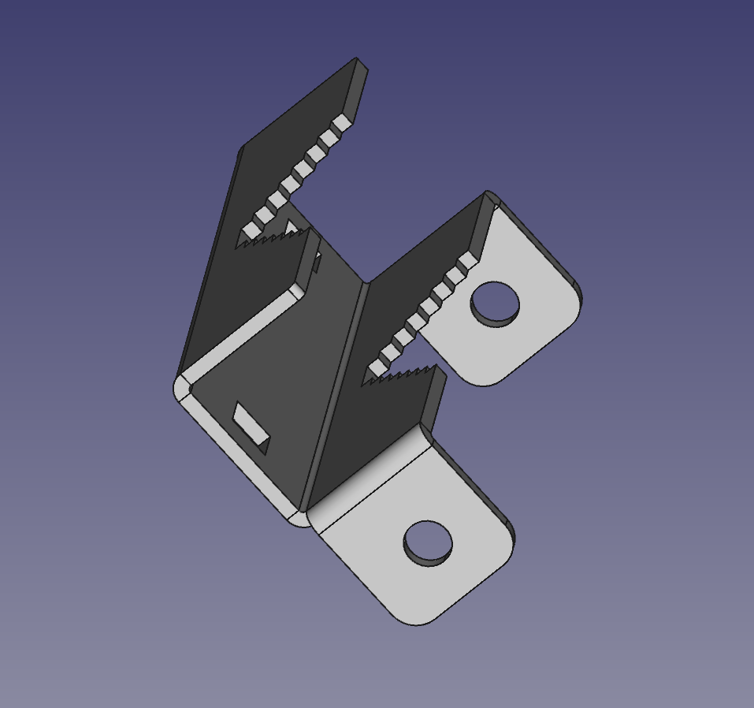
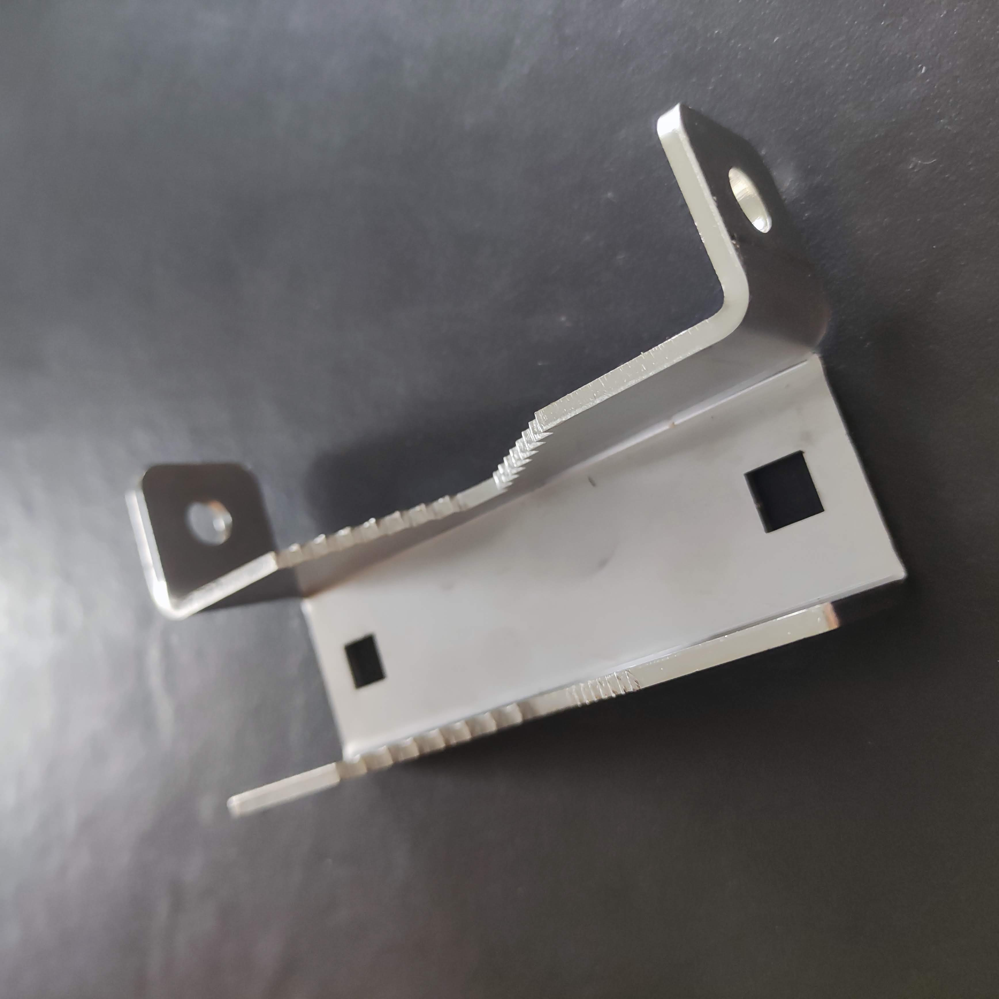
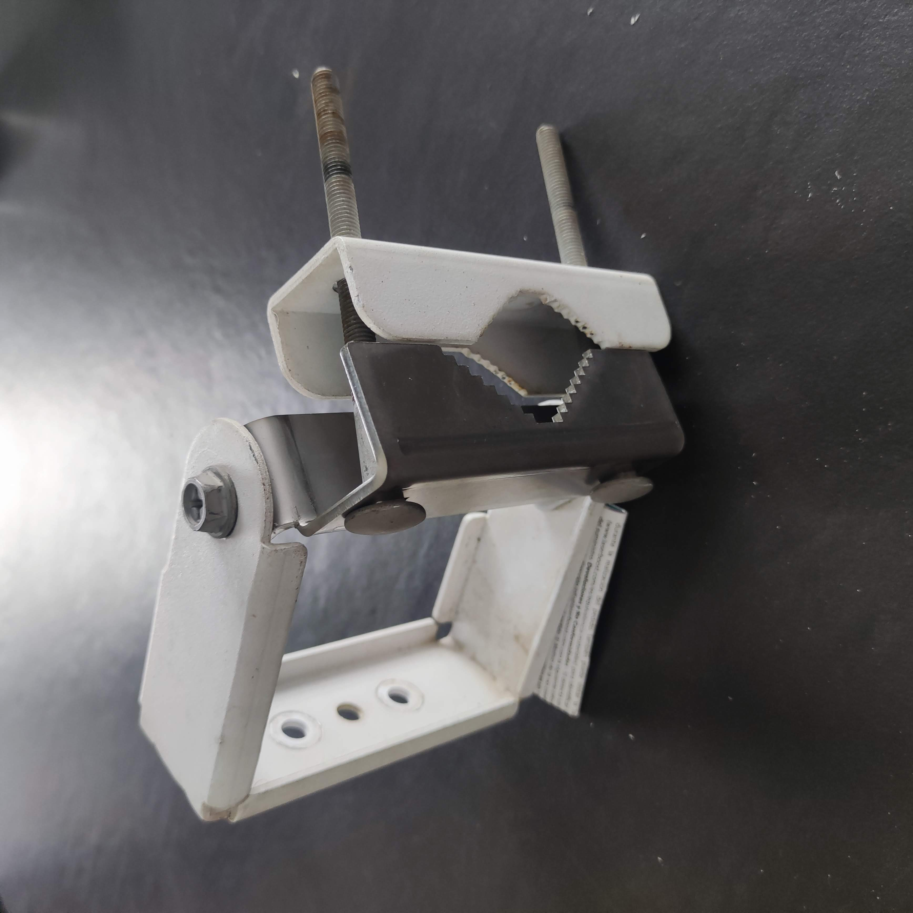

# Ubiquiti Titanium Bracket

This bracket is a replacement of the bracket from Ubiquiti,
and is intended to fill the same role entirely.

Target device: Ubiquiti Titanium

Manufacturing: 3mm lasercut + bent sheet metal

## Status
v1 has been received from produced, tested & works.

## v1

